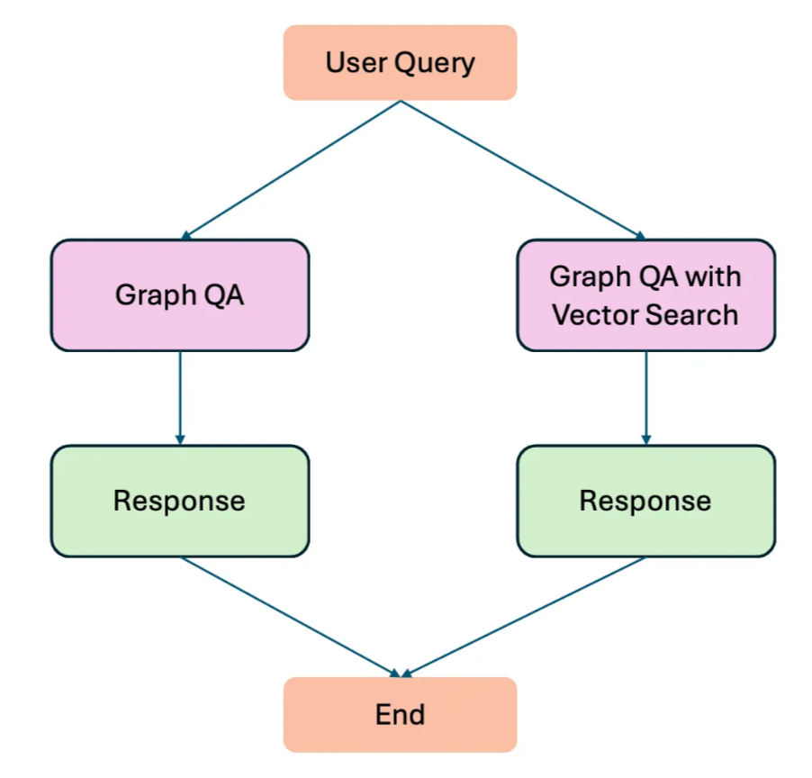

# Neo4j GraphRAG Workflow with LangChain and LangGraph
**Author**: [Suman Gautam](https://www.linkedin.com/in/suman-gautam-usa/)

## Overview
This repos contain notebooks and scripts to chat with Neo4j Graph database. Using LangGraph, a workflow is designed, which takes an user query and performs either GraphQA or GraphQA with Vector Search. This graph db for this experiment was created in Neo4j with academic journals metadata from OpenAlex.

This repo is also a companion to a medium article linked here [GraphRAG medium article](https://smngeo.medium.com/neo4j-rag-application-with-langgraph-36f385ee3927)

An example of a workflow:
 

## Requirements
In order to run this repo, you will need access to openai api key and Neo4j graph db instance.

Following api access are required:
'OPENAI_API_KEY',
'AURA_CONNECTION_URI',
'AURA_USERNAME',
'AURA_PASSWORD'

The best way to supply them is through ennvironment variable. 

For Neo4j db, you can spin up a free Neo4j instance here: [Neo4j AuraDB](https://neo4j.com/cloud/platform/aura-graph-database/?ref=nav-get-started-cta)
For academic metadata, you can access through OpenAlex api here: [OpenAlex](https://docs.openalex.org/)


## Git Push
```
git status
git add .
git commit -m "Your commit message"
git push origin master
```
## Git ignore
Update the .gitignore file.

If git status shows unintended files, you can remomve them manually from the cache
```
git rm -r --cached neo4j_rag_with_langGraph/.ipynb_checkpoints/
```
